<div align="center">



# synaptic

**Visualize the dependency graph of any Python project.**  
Internal imports · Cloud SDKs · HTTP clients · Circular deps — all in one command.

[](https://python.org)
[](LICENSE)
[](https://typer.tiangolo.com)
[](https://rich.readthedocs.io)

</div>

---

## Features

- **Static AST analysis** — no runtime execution needed
- **Internal imports** — maps every `import` and `from X import Y` across your codebase
- **Cloud SDK detection** — identifies AWS (`boto3`), GCP (`google.cloud`, `firebase_admin`) and Azure (`azure.*`) usage
- **HTTP client detection** — flags modules using `requests`, `httpx`, `aiohttp`, `urllib3` and more
- **Circular dependency highlighting** — broken cycles rendered in red
- **Two output formats** — interactive HTML (`pyvis`) or static SVG/PNG (`graphviz`)
- **Rich terminal output** — live progress, color-coded summary

---

## Installation

```bash
pip install synaptic
```

Or from source:

```bash
git clone https://github.com/your-username/synaptic
cd synaptic
pip install -e .
```

> **Requirements:** Python 3.10+, `graphviz` binary installed on your system (`apt install graphviz` / `brew install graphviz`).

---

## Quick start

```bash
# Interactive HTML graph (default)
synaptic scan ./my-project

# Custom output path
synaptic scan ./my-project --output architecture.html

# SVG with circular dependency highlighting
synaptic scan ./my-project --output graph.svg --circular

# Skip cloud and HTTP detection, filter stdlib
synaptic scan ./my-project --no-cloud --no-http --filter-stdlib

# Include test files in the scan
synaptic scan ./my-project --tests
```

---

## Options

| Flag | Default | Description |
|---|---|---|
| `--output`, `-o` | `synaptic_graph.html` | Output file (`.html` or `.svg`) |
| `--cloud / --no-cloud` | `on` | Detect AWS / GCP / Azure SDKs |
| `--http / --no-http` | `on` | Detect HTTP client libraries |
| `--tests / --no-tests` | `off` | Include test files |
| `--filter-stdlib / --no-filter-stdlib` | `on` | Exclude Python stdlib from graph |
| `--filter-external / --no-filter-external` | `off` | Exclude third-party packages |
| `--circular`, `-c` | `off` | Highlight circular dependencies in red |
| `--version`, `-v` | — | Show version and exit |

---

## Architecture

```
synaptic/
├── cli.py             # Typer CLI + Rich output
├── scanner.py         # Recursive .py file discovery
├── parser.py          # AST-based import analysis
├── cloud_detector.py  # AWS / GCP / Azure SDK detection
├── http_detector.py   # HTTP client library detection
├── graph.py           # networkx graph + graphviz / pyvis rendering
└── utils.py           # Shared helpers
```

---

## Node types

| Color | Meaning |
|---|---|
| 🔵 Blue | Internal project module |
| 🟠 Orange | AWS / GCP / Azure SDK |
| 🩷 Pink | HTTP client (requests, httpx…) |
| ⚫ Grey | Stdlib / external package |
| 🔴 Red edge | Circular dependency |

---

## License

MIT © 2024
